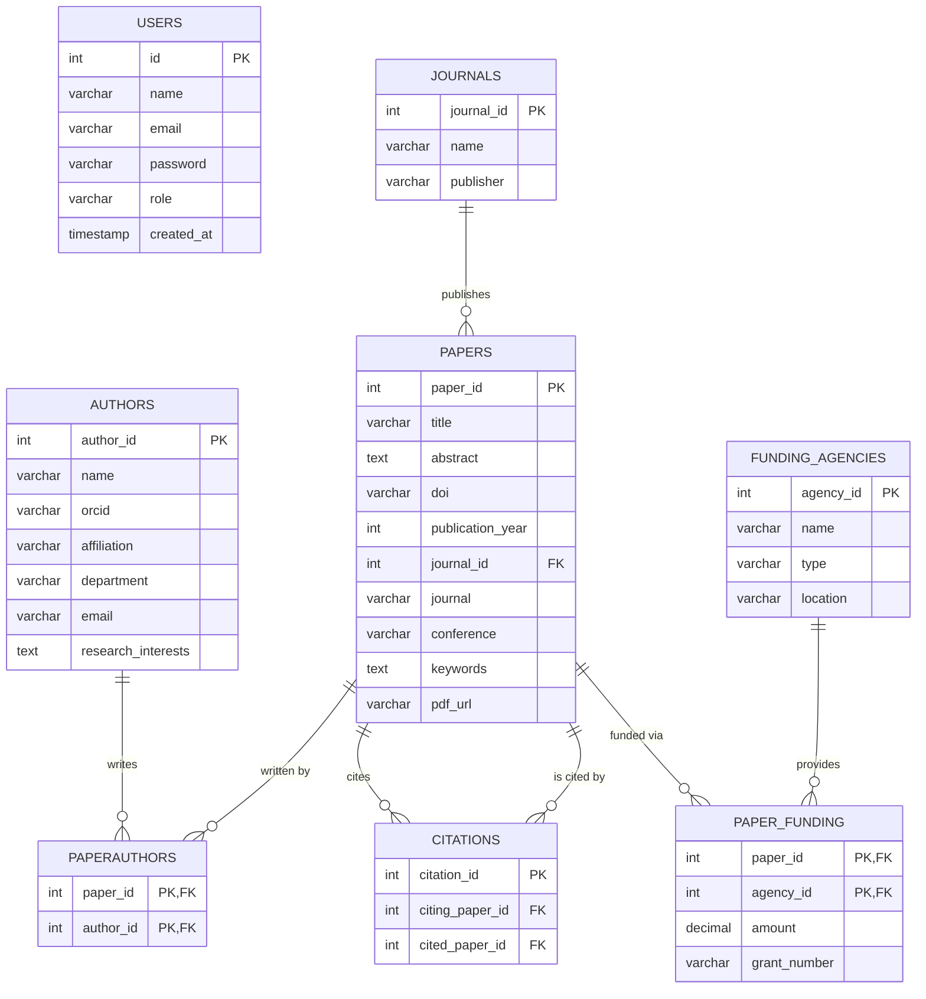

# Research Publication Management System

A full-stack, role-based application designed to meticulously track, manage, and analyze research publications, authors, citations, and funding grants. Built with **Next.js**, **Express.js**, and **PostgreSQL**.

---

## 🌟 Features & Functionality

This platform is divided into several core modules that help institutions organize their research output:

- **Dashboard**: A birds-eye view of total publications, active researchers, total citations, and recent activity.
- **Publications Management**: A complete CRUD interface for academic papers, tracking DOI, journals, and keywords.
- **Authors & Collaborations**: Manage researcher profiles. Features a powerful **Recommendation Engine** that suggests potential collaborators based on mutual co-authors, and tracks **Self-Citation Patterns** to ensure metric integrity.
- **Funding & Grants**: Allows administrators to register funding agencies (e.g., NSF, Google Research) and assign financial grants to specific papers. Includes a visual chart for funding distribution.
- **Analytics Dashboard**: Computes complex academic metrics on-the-fly, including **h-index**, **i10-index**, and total citation breakdowns via raw SQL queries.
- **Explore (OpenAlex Integration)**: Search for external papers and global publications using the public [OpenAlex API](https://openalex.org/).
- **DBMS Educational Logic**: Detailed explanation of [Normalization, 3NF, and Data Decommissioning](file:///c:/Users/Rupam/Desktop/NOTES/4TH%20SEMESTER/DBMS/Project1/research-publication-system/docs/DATABASE_LOGIC.md) used in the system.

### 🛡️ Role-Based Access Control (RBAC)

The system enforces strict UI and Backend API restrictions based on three user tiers:

| Role | Permissions |
| :--- | :--- |
| **Administrator** | **Full Access**. Can add, edit, and forcefully delete publications, authors, citations, and funding agencies. |
| **Librarian** | **Management Access**. Can add and edit authors, publications, and funding grants, but generally cannot perform destructive deletes. |
| **Researcher** | **Read-Only Access**. Can explore publications, view analytics, and find collaboration recommendations. All creation/modification forms are hidden in the UI and blocked at the API level (`403 Forbidden`). |

---

## 🏗️ Architecture & Data Flow

- **Frontend (`/frontend`)**: Built with **Next.js** and **Tailwind CSS**. A responsive, animated UI (`MobileMenuContext`) that consumes the backend REST API via Axios. Protected routes check for JWT tokens. 
- **Backend (`/backend`)**: An **Express.js** API. Uses `pg` to connect to the database. Middleware (`authMiddleware`) intercepts requests to verify JWTs and enforce `authorizeRoles`.
- **Database (`/database`)**: A deeply relational **PostgreSQL** schema. Uses Foreign Keys, `ON DELETE CASCADE` rules, and Common Table Expressions (CTEs) for advanced analytics.

---

## 🚀 Getting Started Step-by-Step

Follow these instructions to get a local copy up and running on your machine.

### 1. Prerequisites
- **Node.js** (v18+ recommended)
- **PostgreSQL** (v14+ recommended)
- Git

### 2. Database Setup
1. Install [PostgreSQL](https://www.postgresql.org/download/) and ensure the command-line tool `psql` is in your system PATH.
2. Open your terminal and log into Postgres:
   ```bash
   psql -U postgres
   ```
3. Create the empty database:
   ```sql
   CREATE DATABASE research_db;
   \q
   ```
4. Navigate to the `database` folder in this project and run the schema and seed scripts to populate the tables with 50+ relational test records:
   ```bash
   cd database
   psql -U postgres -d research_db -f schema.sql
   psql -U postgres -d research_db -f seed.sql
   ```
   *(Enter your postgres password when prompted).*

### 3. Backend Setup
1. Open a new terminal and navigate to the backend directory:
   ```bash
   cd backend
   npm install
   ```
2. Create a `.env` file inside the `backend` folder and configure your variables:
   ```env
   PORT=5000
   DB_USER=postgres
   DB_PASSWORD=your_postgres_password
   DB_HOST=localhost
   DB_PORT=5432
   DB_NAME=research_db
   JWT_SECRET=your_super_secret_jwt_key
   ```
3. Start the backend server:
   ```bash
   npm run dev
   # or `node server.js`
   ```

### 4. Frontend Setup
1. Open a new terminal and navigate to the frontend directory:
   ```bash
   cd frontend
   npm install
   ```
2. Create a `.env.local` file inside the `frontend` folder:
   ```env
   NEXT_PUBLIC_API_URL=http://localhost:5000/api
   ```
3. Start the Next.js development server:
   ```bash
   npm run dev
   ```

### 5. Login to the App
Open `http://localhost:3000` in your browser. You can log in using the mock data generated by `seed.sql`:

- **Admin Account**: `admin@example.com` (Password: `password123`)
- **Researcher Account**: `researcher@example.com` (Password: `password123`)

---

## 📂 Project Structure

```text
├── backend/                  # Express API
│   ├── controllers/          # Business logic & algorithms (Analytics, Recommendations)
│   ├── middleware/           # JWT & RBAC interceptors
│   ├── models/               # Raw PostgreSQL Queries
│   ├── routes/               # Express endpoints router
│   └── server.js             # API Entry point
├── frontend/                 # Next.js UI
│   ├── components/           # Reusable UI (Navbar, responsive Sidebar)
│   ├── context/              # Global React State (AuthContext, MobileMenuContext)
│   ├── pages/                # Next.js Routing Pages (Funding, Authors, Analytics)
│   ├── services/             # Axios API wrappers
│   └── styles/               # Tailwind global configurations
└── database/                 # SQL Scripts
    ├── schema.sql            # Table definitions & schema design
    └── seed.sql              # Massive mock data generation file
```

## Entity Relationships Diagram


